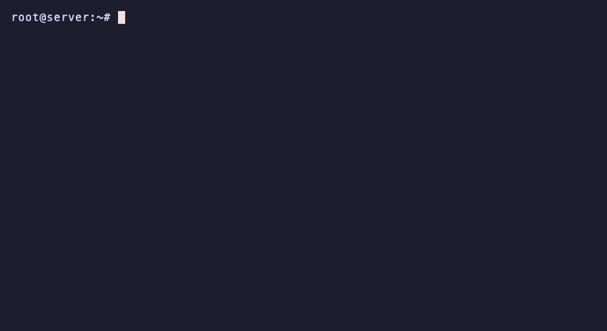

<p align="center">
  <a href="https://flowtriq.com"></a>
</p>

<h1 align="center">ftagent</h1>

<p align="center">
  Real-time DDoS detection, attack classification, PCAP forensics, and auto-mitigation for Linux servers.<br>
  Detects attacks in under 1 second. Classifies 7 families and 16+ subtypes. Mitigates automatically.
</p>

<p align="center">
  <a href="https://pypi.org/project/ftagent/"></a>
  <a href="https://flowtriq.com"></a>
  <a href="https://discord.gg/SsTWMYuyGG"></a>
  <a href="https://flowtriq.com/docs"></a>
</p>

---



---

## What it does

ftagent is the on-node agent for [Flowtriq](https://flowtriq.com), a DDoS detection and mitigation platform built for hosting providers, game server networks, ISPs, and anyone running infrastructure that needs to stay online.

The agent monitors traffic at the packet level, learns your normal traffic patterns, detects attacks the moment they start, classifies them by protocol and vector, captures forensic PCAPs, and triggers automated mitigation through firewall rules, BGP FlowSpec, RTBH, or cloud scrubbing.

### In production

- **159 Gbps multi-vector attack** mitigated in 9 seconds for an EU network operator. 40+ customer prefixes on the affected uplink, zero SLA breaches. Detection at 0.7s, FlowSpec active at 9s. ([Case study](https://flowtriq.com/blog/eu-network-operator-ddos-case-study))

- **48 Gbps NTP amplification + SYN flood** during a live 240-person cybersecurity training event. Full mitigation stack active in under 15 seconds. Not one participant noticed. ([Case study](https://flowtriq.com/blog/lorikeet-security-case-study))

> "159 gig hit our transit edge at ten in the morning. Forty-plus customers on that uplink, including a government account with a hard SLA. The whole thing was mitigated before our legacy SNMP monitoring even knew it was happening."
> -- Head of Network Operations, EU transit operator

---

## Install

```bash
pip install ftagent[full]
sudo ftagent --setup
sudo ftagent --install-service
sudo systemctl enable --now ftagent
```

That's it. Your node appears in the [Flowtriq dashboard](https://flowtriq.com/dashboard) within 30 seconds. 14-day free trial, no credit card required.

### Requirements

- Linux (Ubuntu 20.04+, Debian 11+, CentOS 8+)
- Python 3.8+
- Root / sudo (for raw packet capture)
- A [Flowtriq account](https://flowtriq.com/signup)

### From source

```bash
git clone https://github.com/flowtriq/ftagent.git
cd ftagent
pip install -e .[full]
```

---

## Detection

### L3/L4 (packet-level)

The agent samples PPS/BPS every second and maintains adaptive baselines with time-of-day awareness. When traffic exceeds the threshold, an incident is opened, classified, and reported within one second.

**Attack families:** UDP flood, SYN flood, TCP flood (ACK/RST/FIN/PSH), DNS flood, ICMP flood, protocol flood (GRE/ESP), fragment flood, multi-vector

**Attack subtypes:** DNS amplification, NTP amplification, SSDP, memcached, CLDAP, CharGEN, SNMP, mDNS, WS-Discovery, SYN-ACK flood, XMAS flood, NULL flood, UDP fragment flood, QUIC flood, and more

**Threat intel enrichment:** 481,000+ active IOCs from 26 threat feeds. When a known botnet signature (Mirai, Gafgyt, Mozi, XorDDoS, etc.) or DDoS tool (LOIC, MHDDoS, Slowloris) is matched in packet payloads, the incident is labeled with the specific tool name and confidence is boosted.

### L7 (application-layer)

Tails your web server access log (nginx, Apache, Caddy, LiteSpeed, HAProxy, Node.js) and detects HTTP floods via request rate spikes, IP concentration, endpoint targeting, error rate anomalies, and bot UA percentage.

**L7 subtypes:** Volumetric HTTP flood, credential stuffing, API abuse, scraping, slow-rate (R.U.D.Y./Slowloris patterns), single-source abuse, HTTP/2 Rapid Reset (CVE-2023-44487), HTTP/2 SETTINGS flood, HTTP/2 CONTINUATION flood (CVE-2024-27983), QUIC flood

**Threat patterns:** SQLi, XSS, path traversal, RFI/LFI, WordPress probes, Shellshock, Log4j, scanner probes, CVE exploits

### Baselines

Adaptive sliding-window baselines that learn your actual traffic patterns:

- **300-sample rolling window** with p99 percentile calculation
- **Time-of-day awareness** with per-hour baselines (24 buckets). Off-peak hours get more sensitive thresholds, peak hours avoid false positives
- **90-second startup grace period** prevents alerts during initial learning
- **5,000 PPS minimum floor** prevents false positives on quiet servers
- **10-tick hysteresis** prevents flapping on resolution
- **IP safelists** for known-good traffic sources

---

## Mitigation

When an attack is detected, ftagent can execute mitigation automatically through a 4-tier escalation ladder:

1. **Local firewall** - iptables/nftables rate limiting, SYN cookies, conntrack tuning, source blocking (27 action types + 5 kernel-level intents)
2. **BGP FlowSpec** - Push flow-specification rules to upstream routers via ExaBGP, GoBGP, BIRD 2, or FRRouting
3. **BGP RTBH** - Remote triggered blackhole routing for volumetric attacks
4. **Cloud scrubbing** - Auto-divert to Cloudflare Magic Transit, OVH, Hetzner, AWS Shield, DigitalOcean, Vultr, or Linode/Akamai

All mitigation rules auto-undo when the incident resolves. Full audit trail in the dashboard.

---

## PCAP forensics

Every incident gets a packet capture automatically:

- **1,000-packet pre-attack ring buffer** captures traffic from before the attack started
- **Up to 10,000 packets per incident** with configurable limits
- **Auto-upload** to the dashboard on incident resolution
- **In-browser PCAP viewer** with packet filtering, protocol breakdown, and AI-powered analysis
- **7-day retention** (365-day on enterprise plans)
- Capture modes: scapy (real-time per-packet) or tcpdump (kernel-speed, recommended for high-traffic nodes)

---

## Alerting

13 notification channels with multi-step escalation policies:

Discord, Slack, PagerDuty, OpsGenie, Microsoft Teams, Telegram, email, SMS, custom webhooks, browser push, Grafana, Datadog, Prometheus

Escalation policies support per-step delays, severity-based routing, maintenance window suppression, and correlated incident deduplication.

---

## Integrations

| Category | Integrations |
|---|---|
| **Alert channels** | Discord, Slack, PagerDuty, OpsGenie, Teams, Telegram, Email, SMS, Webhooks, Grafana, Datadog, Prometheus |
| **BGP adapters** | ExaBGP, GoBGP, BIRD 2, FRRouting, Cloudflare, Radware, F5, Webhook |
| **Cloud scrubbing** | Cloudflare Magic Transit, OVH, Hetzner, AWS Shield, DigitalOcean, Vultr, Linode/Akamai, Cloudflare WAF |
| **SIEM** | Splunk HEC, Elasticsearch, Microsoft Sentinel, Syslog CEF, Wazuh, MISP |
| **Observability** | Grafana, Datadog, Prometheus |
| **Firewall** | iptables, ipset, nftables, ufw, tc, fail2ban, XDP/eBPF |
| **Flow sources** | sFlow v5, NetFlow v5/v9, IPFIX |
| **Panels** | Pterodactyl, WHMCS |

---

## Configuration

Config file: `/etc/ftagent/config.json`

| Key | Default | Description |
|---|---|---|
| `api_key` | -- | **Required.** Your Flowtriq node API key |
| `node_uuid` | -- | **Required.** Node UUID from your dashboard |
| `interface` | `"auto"` | Network interface to monitor |
| `pcap_enabled` | `true` | Enable PCAP capture during incidents |
| `pcap_mode` | `"tcpdump"` | Capture engine: `"tcpdump"` (recommended) or `"scapy"` |
| `dynamic_threshold` | `true` | Adaptive baseline detection |
| `threshold_multiplier` | `3.0` | Alert when PPS exceeds baseline x multiplier |
| `heartbeat_interval` | `30` | Seconds between heartbeats |
| `metrics_interval` | `10` | Seconds between metrics reports |
| `auto_update` | `true` | Auto-update from PyPI with integrity verification |

Full config reference: [flowtriq.com/docs](https://flowtriq.com/docs)

---

## CLI

```
sudo ftagent [options]

  --setup            Interactive setup wizard
  --install-service  Install systemd service unit
  --config PATH      Config file path (default: /etc/ftagent/config.json)
  --test             Test API connectivity
  --tui              Terminal UI dashboard (requires 'rich')
  --version          Show version
  --update           Check for and install updates
```

---

## Pricing

**$9.99/node/month** (or $7.99/month on annual). No activation fees, no bandwidth licensing, no contracts. All features included on every plan. 14-day free trial, no credit card required.

Flow sources from $19/mo. Mirror/SPAN from $49/mo. [Full pricing](https://flowtriq.com/pricing).

---

## Docs

Full documentation: [flowtriq.com/docs](https://flowtriq.com/docs)

---

## Support

- **Docs:** [flowtriq.com/docs](https://flowtriq.com/docs)
- **Discord:** [discord.gg/SsTWMYuyGG](https://discord.gg/SsTWMYuyGG)
- **Issues:** [github.com/flowtriq/ftagent/issues](https://github.com/flowtriq/ftagent/issues)
- **Email:** [hello@flowtriq.com](mailto:hello@flowtriq.com)
